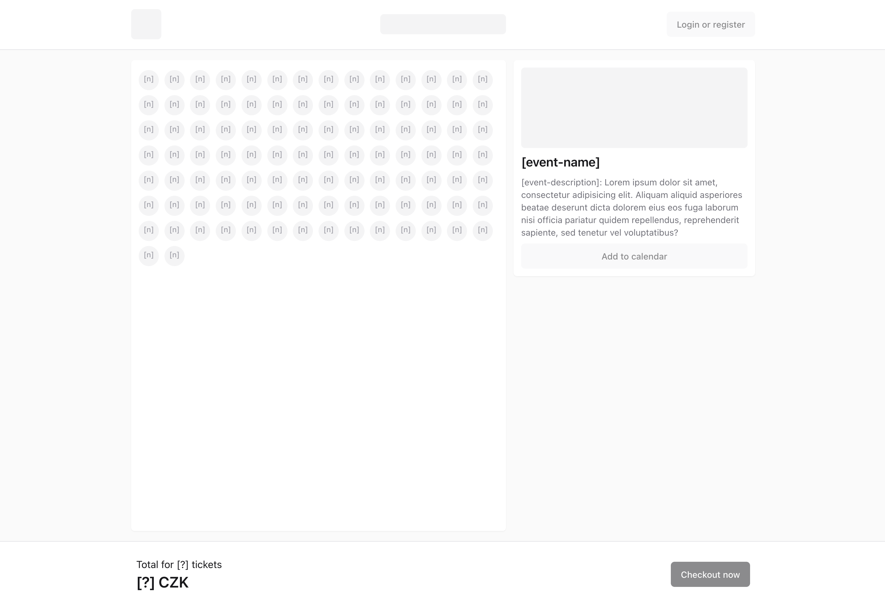

# 🧑🏻‍🚀 NFCtron Frontend Case Study (Seating)

> 👋 Vítejte u zadání pro kandidáty na pozici ⚛️ **Frontend Developer** v NFCtron! Vaším úkolem bude
> dokončit jednoduchou React aplikaci pro nákup vstupenek na akci.

## 🎯 Úvod

Předpřipravili jsme pro vás základ aplikace s přednastavenými nástroji a hlavním layoutem (neznamená to ale však že jej nemůžete upravit dle vlastního uvážení).
Zaroveň pro aplikaci existují připravené [API endpointy](./API.md), které budou potřebné pro získání dat k zobrazení.

**👉🏻 Vaší úlohou bude aplikaci funkčně dokončit.**

### High-Level popis aplikace

Aplikace by měla být jednoduchá SPA, která umožní zobrazit detail akce s mapou dostupných sedadel .
Uživatel si po příchodu může prohlížet sedadla a libovolně je do svého nákupního košíku přidávat či naopak z něj odebírat.
V tomto kroce má uživatel přehled o počtu vstupenek v košíku a jejich celkové hodnotě.
Před dokončením objednávky je uživatel vyzván k vyplnění potřebných údajů, v případě že nevyužil možnost přihlášení se do svého účtu.
Odesláním objednávky je pak uživatel informován o jejím vytvoření či případné chybě a tímto krokem je scope aplikace uzavřen.

## 🌱 Požadavky na Funkčnost

Aplikace by měla být schopna:

-   [ ] Zobrazit onepage detail akce s relevantními údaji z API (obrázek, název, popis, datum, ...)
-   [ ] Zobrazit mapu dostupných sedadel (řada, sedadlo) z API.
    -   zde není třeba mapu vykreslovat optimalizovaně, např. pomocí Canvas API/SVG, postačí jako HTML prvky
    -   pozor na pořadí sedadel (ne vždy přijdou všechna sedadla po sobě 👀)
-   [ ] Po kliku na sedadlo umožnit jeho přidání do košíku (případně odebrání, pokud je již v košíku).
-   [ ] Spravovat obsah košíku s využitím promyšleného state managementu.
-   [ ] Zobrazit aktuální počet vstupenek v košíku a jejich celkovou hodnotu (ve správné měně a formátu).
-   [ ] Po kliknutí na "Koupit vstupenky" umožnit přihlášení nebo vyplnění potřebných údajů jako "host".
-   [ ] Vytvořit objednávku skrze API a zobrazit výsledek (úspěch nebo chybu).

## 🌟 Bonusové Funkce

-   [ ] Umožnit přidání akce do kalendáře.
-   [ ] Multijazyčnost aplikace.

_A dalším vychytávkám se meze nekladou! Ukažte, co umíte! 💫_

## ☝🏻 Dobré vědět

-   Aplikace musí být psána v jazyce **TypeScript**.
-   Využití jiných knihoven není zakázáno, naopak **je doporučeno**.
-   Ve výchozím kódu aplikace lze dělat naprosto libovolné změny.
-   Dbejte na kvalitu kódu, jeho čitelnost a strukturu.

## 📋 Kritéria Hodnocení

-   Funkčnost a splnění funkčních požadavků.
-   Vzhled aplikace a responzivita na mobilních zařízeních.
-   Práce s daty, state management a volání API.
-   Kvalita, struktura a komentování/dokumentace kódu.
-   Práce s Git.

## 🪜 Jak postupovat?

1. Udělejte si fork tohoto repozitáře.
2. Nastavte si své oblíbené vývojové prostředí.
3. Dokončete úkol dle požadavků a zadání výše.
4. Průběžně commitujte a pushujte své změny.
5. Otestujte řádně svou aplikaci.
6. Jakékoliv komentáře, či doplnění informací/dokumentace k vaší práci uvítáme v souboru `COMMENTS.md`.
7. Svou aplikaci ideálně nasaďte na nějaký hosting (doporučujeme ▲ Vercel).
8. Po dokončení úkolu zašlete na email [ditrich@nfctron.com](mailto:ditrich@nfctron.com):
    - odkaz na Váš repozitář,
    - a odkaz na nasazenou aplikaci.

📧 Máte-li jakékoli dotazy nebo potřebujete pomoci, neváhejte se na nás obrátit.

---

Přejeme vám hodně štěstí a těšíme se na vaše řešení! 🌟

_–– Tým NFCtron_
